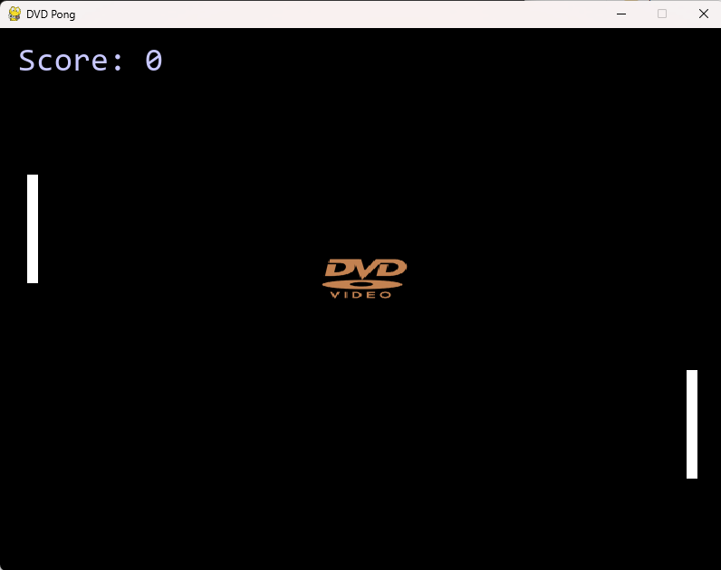

# 📀 DVD Pong

What happens when you combine a DVD logo with the eternal struggle of Pong?  
You get **DVD Pong**: the most critical advancement in screen bouncing tech since 2001.

## 🎮 How to Play

- Use `W` / `S` **or** `↑` / `↓` to control the paddle on the left
- The right paddle is a robot. It never sleeps.
- Bounce the DVD logo.
- Don’t miss. Seriously.
- Score goes up when you hit it. That's how numbers work.

## 🧠 Features

- Changing DVD logo colors 🎨
- AI opponent that always tries its best 🤖
- Game Over when you let it go... like Elsa ❄️
- Realistic beeping sounds from the future 🚨
- About info so you remember who blessed you with this experience ✨

## 📎 Credits

- Developed by **Kelsi Davis**
- [Website](https://geekastro.dev)
- [GitHub](https://github.com/Kelsidavis)

## 🐛 Bugs?

If something breaks, it's part of the charm.  
Or open an issue, I guess. That works too.

---

“DVD Pong changed my life.” – Definitely not someone I paid to say that
